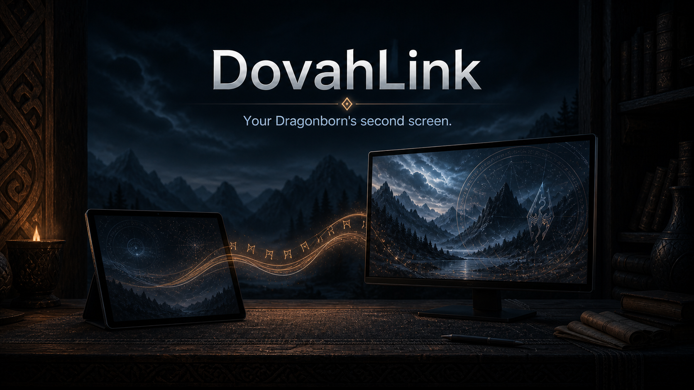

# DovahLink

<p align="center">
  
</p>

<p align="center"><strong>Your Dragonborn's second screen.</strong></p>

<p align="center">
  <strong>DovahLink is under active development</strong>
</p>

DovahLink is a source-available companion platform for modded Skyrim. It connects Skyrim's live game state with a second monitor, tablet, or phone so players can build the companion interface that fits their playthrough.

The first supported release will focus on the foundation: a reliable local connection between Skyrim
and an external client, with read-only character information.

## Current development baseline

The repository's historical `0.3.2` release, built on the now-retired native plugin implementation,
is not a supported public release or a compatibility target; the previous Nexus listing was removed
because the companion application was not publicly downloadable. Production development now
continues exclusively on the native Skyrim Adapter and the out-of-process C# Host described in
[ARCHITECTURE.md](ARCHITECTURE.md).

That historical baseline provided:

- Local, authenticated communication between Skyrim and one external client
- Read-only character state with the player's current level
- Known Device trust administration, including revoke, block, unblock, forget, and reset operations
- Administrative session invalidation with developer-token isolation
- Clear handling for unsupported runtimes and failed connections
- A Vortex-ready installation package

The current development target supports Steam Skyrim Special Edition `1.7.104` with SKSE64
`2.3.1`. The companion client is developed in this repository but is not included in a supported
public release yet.

## Planned direction

- Live interactive map
- Character and status dashboard
- Inventory, equipment, and spell views
- World exploration tools
- Customizable companion layouts
- Support for heavily modded load orders

These are product goals, not promises for the current release.

## Project shape

```text
Skyrim
   |
Native SKSE Adapter
   |  private IPC
C# Host
   |  DovahLink protocol / WebSocket
PC / tablet / phone
```

The Adapter is a thin native plugin that owns only the Skyrim/SKSE boundary. The Host is a
standalone, out-of-process application that owns networking, sessions, trust, and state, and speaks
the public DovahLink protocol to clients. See [ARCHITECTURE.md](ARCHITECTURE.md) for the full
system boundaries.

## Project documentation

- [PRODUCT.md](PRODUCT.md) defines the product and its boundaries.
- [ARCHITECTURE.md](ARCHITECTURE.md) defines the system boundaries and technical direction.
- [ROADMAP.md](ROADMAP.md) is the source of truth for phase status, order, and dependencies.
- [CONTRIBUTING.md](CONTRIBUTING.md) defines the development and proposal workflow.
- [DEVELOPMENT.md](DEVELOPMENT.md) explains how to install and verify local development prerequisites.
- [TROUBLESHOOTING.md](TROUBLESHOOTING.md) addresses known issues and solutions.

## License

DovahLink is source-available, not open source in the OSI sense: the source is public, but the
license restricts commercial use. Everything in this repository except `adapter/` is licensed
under the [PolyForm Noncommercial License 1.0.0](LICENSE). `adapter/`, the native Skyrim SKSE
plugin, is licensed separately under [GPL-3.0-or-later](adapter/LICENSE) because it links
[CommonLibSSE-NG](https://github.com/alandtse/CommonLibSSE-NG), which is GPL-licensed.

## Name

"Dovah" means dragon in the dragon language of Skyrim. "Link" describes the connection between the game and the player's companion devices.
